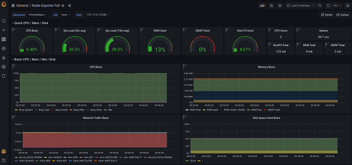

# Тестовое задание 


## Описание
1. Запускает виртуальную машину из vagrant-бокса [generic/ubuntu2004](https://app.vagrantup.com/generic/ ).
2. Внутри виртуальной машины Ubuntu средствами ansible происходит автоматическая установка docker, docker compose и prometheus-node-exporter.
3. С помощью docker compose запускаются 2 контейнера.
4. Первый контейнер с [Prometheus](https://prometheus.io/), настроеный на сбор метрик с prometheus-node-exporter из Ubuntu.
5. Второй контейнер с [Grafana](https://grafana.com/), настроенная на использование в качестве datasource системы мониторинга prometheus из первого контейнера. Также в grafana загружен [Node exporter full dashboard](https://grafana.com/grafana/dashboards/1860) (dashboard 1860), который визуализирует метрики полученные с prometheus-node-exporter.
6. Контейнер с grafana пробрасывает 3000 порт виртуальную машину ubuntu.
7. Виртуальная машина ubuntu пробрасывает 3000 порт в хостовую машину.              
После запуска проекта на хостовой машине, по адресу localhost:3000, будет доступен dashboard с метриками виртуальной машины ubuntu.

## Структура проекта
```shell
├── Vagrantfile
├── ubuntu2004.box 
├── ansible
│   ├── install-docker.yml
│   ├── main.yml
│   ├── setup-containers.yml
│   ├── docker
│   │   ├── docker-compose.yml
│   │   ├── grafana
│   │   │   ├── dashboards.yml
│   │   │   ├── datasources.yml
│   │   │   ├── Dockerfile
│   │   │   └── node-exporter-full.json
│   │   └── prometheus
│   │       ├── Dockerfile
│   │       └── prometheus.yml


```
### Описание файлов
* **Vagrantfile**     ---  файл конфигурации vagrant
* **ubuntu2004.box**  ---  vagrant-box, из которого создается виртуальная машина

В директории ansible хранятся плейбуки и, в папке docker, файлы конфигурации docker-compose 

## Подготовка к запуску
Перед запуском проекта необходимо установить пакеты vagrant и ansible, а так же модуль community.docker для asnible
*Ubuntu*
```shell
sudo apt update
sudo apt install vagrant ansible
ansible-galaxy collection install community.docker
```

## Запуск
Для запуска перейдите в корневую директорию проекта и выполните команду:
```shell
vagrant up
vagrant provision
```
>*Note:*  После запуска, vagrant попытается загрузить из сети бокс generic/ubuntu2004. В случае, если загрузка из сети не удалась бокс необходимо [скачать](https://app.vagrantup.com/generic/) и добавить вручную из файла с помощью команды:  
>```shell 
>vagrant box add <имя скачанного файла> --name generic/ubuntu2004
>```
>После добавления заново запустите vagrant up


После запуска дождитесь завершения работы vagrant и перейдите в браузер по адресу:
```shell
localhost:3000
```
В результате в браузере отобразиться окно входа в web-интерфейс grafana. 
Данные авторизации по умолчанию:

**login**:    admin  
**password**: admin


Затем нужно задать новый пароль, после чего откроется панель с метриками виртуальной машины ubuntu.




